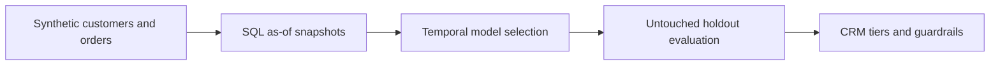

# Customer Lifetime Value Decision System

[](https://github.com/parisaMSTFV/customer-lifetime-value-decision-system/actions/workflows/ci.yml)
[](https://www.python.org/)
[](data/README.md)
[](LICENSE)

An end-to-end decision system that estimates **180-day discounted customer contribution margin** for non-contractual ecommerce, validates the estimate on a future period, and turns the ranking into transparent CRM service tiers.

> All customers, orders, and results are synthetic. Executed metrics validate the workflow under a controlled setup; they are not claims about production performance.

## The decision

Customer teams often have limited service capacity and intervention budgets. The useful question is not simply “Who has high historical spend?” It is:

**Which customers are expected to create the most contribution margin over the next 180 days, how uncertain is that estimate, and what level of customer investment is economically defensible?**

This project separates three layers that are easy to conflate:

1. **Prediction:** estimate future discounted contribution margin.
2. **Uncertainty:** show an 80% model interval and flag unstable estimates.
3. **Policy:** assign relative service tiers and conservative spending ceilings from explicit configuration.

The policy does not claim that a treatment will cause the predicted value. Treatment uplift requires experimental or causal evidence.

## Executed holdout results

The final snapshot (`2024-12-31`) is untouched during model and hyperparameter selection.

| Metric | CLV model | RFM value baseline | Interpretation |
|---|---:|---:|---|
| WAPE | **0.415** | 0.592 | 29.9% relative error reduction |
| MAE | **32.03** | 45.67 | Lower absolute error in synthetic currency units |
| Spearman rank correlation | **0.813** | 0.736 | Better ordering for prioritization |
| Top 10% realized value capture | **24.4%** | 22.4% | Value concentrated within fixed capacity |
| Top 20% realized value capture | **43.4%** | 40.2% | Ranking advantage persists at wider coverage |
| Nominal 80% interval coverage | 74.0% | — | Useful but under-covered; recalibration is required before production use |

The **Protect** tier contains 10% of holdout customers and 24.4% of realized holdout value.


## Workflow



- The generator creates lifecycle, seasonality, return, discount, and margin behavior with a fixed seed.
- Executable SQL builds every feature using orders available on or before the snapshot date.
- A two-part model estimates the probability of future activity and margin conditional on activity.
- Quantile models provide lower and upper bounds for the 180-day value estimate.
- A fixed baseline uses trailing contribution margin, recency, and recent momentum.

See [Methodology](docs/METHODOLOGY.md) for the full design and [Model Card](docs/MODEL_CARD.md) for intended use and limitations.

## Decision output

The scored customer artifact contains:

- `predicted_clv_180d`: expected discounted contribution margin;
- `active_probability_180d`: probability of any purchase in the horizon;
- `clv_lower_80` and `clv_upper_80`: model uncertainty interval;
- `service_tier`: Protect, Grow, Nurture, or Low Touch;
- `investment_ceiling`: configurable guardrail based on the lower value bound;
- `high_uncertainty`: review flag for wide intervals.


The complete rules and economic caveats are documented in [Decision Policy](docs/DECISION_POLICY.md).

## Reproduce the project

```bash
git clone https://github.com/parisaMSTFV/customer-lifetime-value-decision-system.git
cd customer-lifetime-value-decision-system
python -m venv .venv
```

Activate the environment:

```bash
# macOS / Linux
source .venv/bin/activate

# Windows PowerShell
.venv\Scripts\Activate.ps1
```

Install and run:

```bash
python -m pip install -e .
python scripts/run_pipeline.py
python -m unittest discover -s tests -v
```

The pipeline regenerates data, scores, summaries, figures, and `reports/metrics.json`.
CI requires byte-identical synthetic data and compares machine-readable model outputs
with a strict numerical tolerance for cross-platform floating-point differences. PNG
files may differ at the binary level across rendering environments. The committed data
fingerprint is `b24f3c2d959f40ea`.

## Repository map

| Path | Purpose |
|---|---|
| `src/clv_decision_system/` | Synthetic data, features, models, evaluation, policy, and reporting |
| `sql/` | Executed leakage-safe feature and label queries |
| `configs/pipeline.json` | Time windows, random seed, tier capacity, and spending guardrails |
| `data/` | Generated synthetic inputs and temporal snapshots |
| `artifacts/` | Holdout scores, tier summary, feature importance, and model metadata |
| `reports/` | Machine-readable metrics, business summary, and generated figures |
| `tests/` | Data, temporal-boundary, model, metric, and policy tests |
| `.github/workflows/ci.yml` | Python 3.11/3.12 quality and reproducibility checks |

## Limitations

- “Lifetime value” is operationalized as a 180-day horizon, not an unlimited lifetime.
- Synthetic performance cannot establish production accuracy or business impact.
- Customers are re-observed across snapshots, matching a recurring scoring setup; evaluation is out-of-time rather than customer-disjoint.
- The 80% interval covered 74% of the holdout and needs recalibration under new data.
- The service policy is a decision rule, not a causal treatment model.
- Contribution margin definitions and cost assumptions must be rebuilt for each business context.

## Documentation

- [Methodology](docs/METHODOLOGY.md)
- [Model Card](docs/MODEL_CARD.md)
- [Decision Policy](docs/DECISION_POLICY.md)
- [Data Dictionary](docs/DATA_DICTIONARY.md)
- [Executed Decision Report](reports/executive_summary.md)
