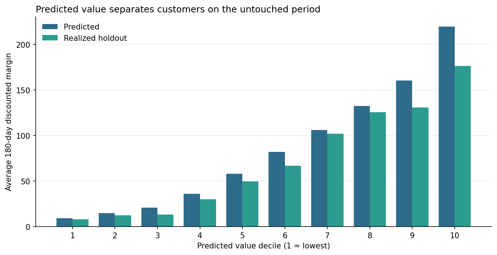
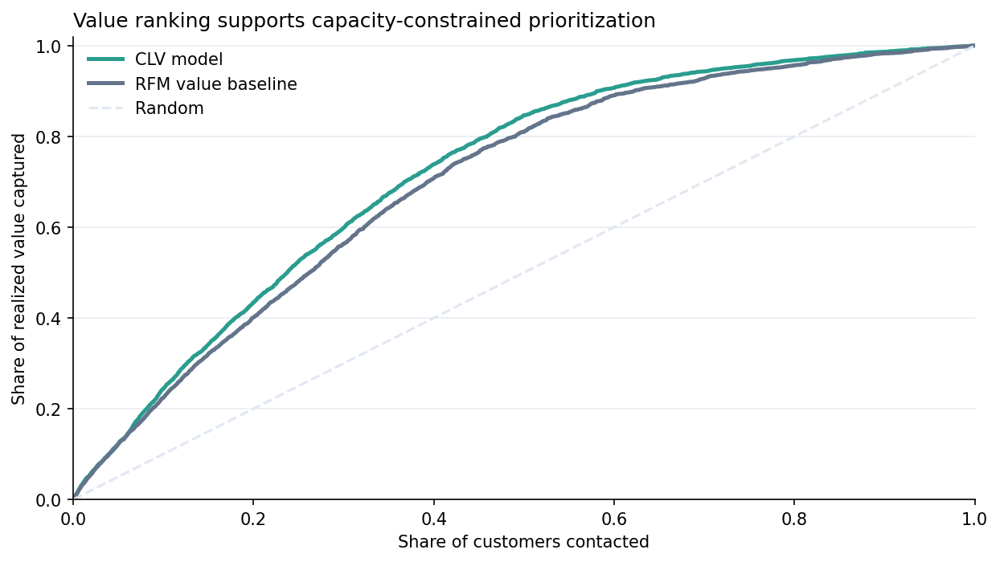
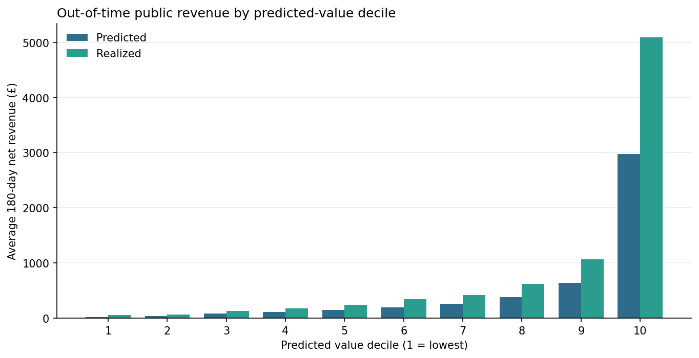
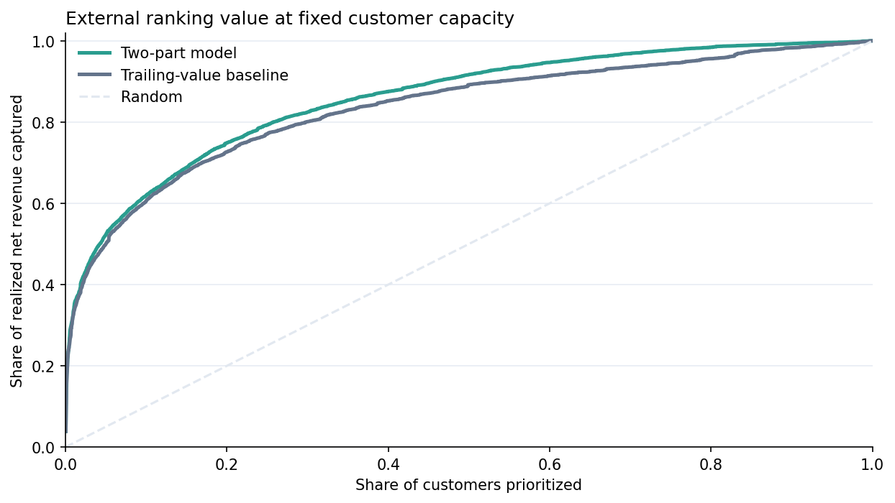
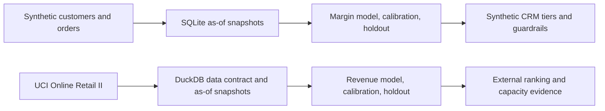
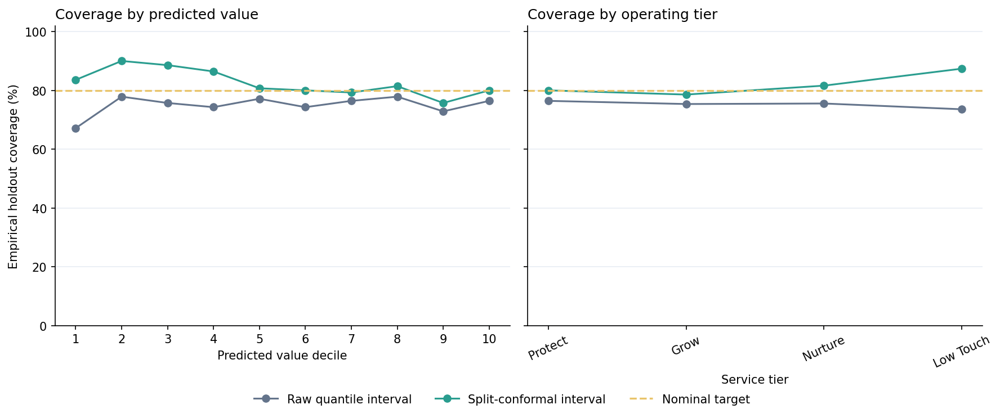
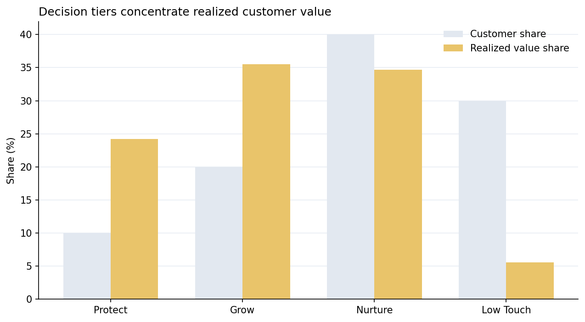

# Customer Lifetime Value Decision System

[](https://github.com/parisaMSTFV/customer-lifetime-value-decision-system/actions/workflows/ci.yml)
[](https://www.python.org/)
[](docs/PUBLIC_DATA_CARD.md)
[](LICENSE)

An end-to-end customer-value decision system with two complementary evidence paths: a
controlled synthetic contribution-margin case and a licensed external validation on
real retail transactions.

> The decision-policy case is synthetic. The separate external validation uses UCI
> Online Retail II under CC BY 4.0. No employer data, confidential business logic, or
> row-level public customer output is committed.

## The decision

Customer teams often have limited service capacity and intervention budgets. The useful question is not simply “Who has high historical spend?” It is:

**Which customers are expected to create the most contribution margin over the next 180 days, how uncertain is that estimate, and what level of customer investment is economically defensible?**

This project separates three layers that are easy to conflate:

1. **Prediction:** estimate future discounted contribution margin.
2. **Uncertainty:** calibrate an 80% interval on a dedicated future snapshot and flag unstable estimates.
3. **Policy:** assign relative service tiers and conservative spending ceilings from explicit configuration.

The policy does not claim that a treatment will cause the predicted value. Treatment uplift requires experimental or causal evidence.

## Executed synthetic holdout results

The final snapshot (`2024-12-31`) is untouched during model selection, interval calibration, and policy design.

| Metric | CLV model | RFM value baseline | Interpretation |
|---|---:|---:|---|
| WAPE | **0.421** | 0.592 | 28.8% relative error reduction |
| MAE | **32.54** | 45.67 | Lower absolute error in synthetic currency units |
| Spearman rank correlation | **0.808** | 0.736 | Better ordering for prioritization |
| Top 10% realized value capture | **24.2%** | 22.4% | Value concentrated within fixed capacity |
| Top 20% realized value capture | **43.3%** | 40.2% | Ranking advantage persists at wider coverage |
| Raw nominal 80% interval coverage | 71.4% | — | Uncalibrated quantile interval under-covers |
| Split-conformal 80% interval coverage | **81.4%** | — | Calibrated without using the final holdout |

The **Protect** tier contains 10% of holdout customers and 24.2% of realized holdout value.





## Public external validation

The same temporal discipline was tested outside the simulator on licensed
[UCI Online Retail II](docs/PUBLIC_DATA_CARD.md) transactions. DuckDB constructs five
leakage-safe customer snapshots from 812,295 usable transaction lines. The target is
**180-day net revenue**—not margin, profit, causal uplift, or unlimited lifetime value.

The June 2011 snapshot remained untouched until model selection and interval calibration
were complete.

| Metric | Two-part model | Fixed trailing-value baseline | Honest interpretation |
|---|---:|---:|---|
| WAPE | 0.689 | **0.662** | Baseline point error is 4.0% lower |
| Spearman rank correlation | **0.598** | 0.557 | Model orders customers better |
| Top 10% realized value capture | **61.9%** | 60.6% | Small model advantage at tight capacity |
| Top 20% realized value capture | **74.9%** | 72.6% | Ranking advantage persists |
| Raw / calibrated 80% interval coverage | 87.8% / 87.8% | — | Raw interval already exceeded target; correction was £0 |

This is deliberately a mixed result: the model does **not** beat the simple baseline on
point accuracy, while it does improve ranking and fixed-capacity value capture. The
baseline and negative result are retained to prevent cherry-picking.





See the [executed public report](reports/public_validation/executive_summary.md) and
[machine-readable metrics](reports/public_validation/metrics.json).

## Workflow



- The generator creates lifecycle, seasonality, return, discount, and margin behavior with a fixed seed.
- Executable SQL builds every feature using orders available on or before the snapshot date.
- A two-part model estimates the probability of future activity and margin conditional on activity.
- Quantile models provide raw lower and upper bounds for the 180-day value estimate.
- A separate 2024-06-30 snapshot fits one split-conformal correction before the final holdout is opened.
- A fixed baseline uses trailing contribution margin, recency, and recent momentum.

See [Methodology](docs/METHODOLOGY.md) for the full design and [Model Card](docs/MODEL_CARD.md) for intended use and limitations.

## Interval calibration and decision impact

The raw 80% quantile interval covered 71.7% of the dedicated calibration snapshot. A
finite-sample split-conformal correction of 3.48 synthetic currency units increased
calibration-snapshot coverage to 80.1%. On the untouched final snapshot, coverage moved
from 71.4% to 81.4%, while mean interval width increased from 98.4 to 104.7.

Calibration also changed the downstream guardrails: the high-uncertainty flag rate moved
from 67.3% to 70.1%, and the aggregate investment ceiling decreased from 4,220.8 to
3,905.9 synthetic currency units. This is the intended behavior of a conservative lower
bound—not a claim that the policy is economically optimal.



Marginal coverage does not imply equal conditional coverage. The Protect tier reached
74.3% and the highest predicted-value decile reached 74.3%, both below the 80% target.
The committed [decile](reports/interval_coverage_by_decile.csv) and
[tier](reports/interval_coverage_by_tier.csv) diagnostics keep that remaining limitation visible.

## Decision output

The scored customer artifact contains:

- `predicted_clv_180d`: expected discounted contribution margin;
- `active_probability_180d`: probability of any purchase in the horizon;
- `clv_lower_80_raw` and `clv_upper_80_raw`: uncalibrated quantile interval;
- `clv_lower_80` and `clv_upper_80`: split-conformal interval used by the policy;
- `service_tier`: Protect, Grow, Nurture, or Low Touch;
- `investment_ceiling`: configurable guardrail based on the lower value bound;
- `high_uncertainty`: review flag for wide intervals.



The complete rules and economic caveats are documented in [Decision Policy](docs/DECISION_POLICY.md).

## Reproduce the project

```bash
git clone https://github.com/parisaMSTFV/customer-lifetime-value-decision-system.git
cd customer-lifetime-value-decision-system
python -m venv .venv
```

Activate the environment:

```bash
# macOS / Linux
source .venv/bin/activate

# Windows PowerShell
.venv\Scripts\Activate.ps1
```

Install and run:

```bash
python -m pip install -e .
python scripts/run_pipeline.py
python -m unittest discover -s tests -v
```

Run the full licensed public-data path separately:

```bash
make public-data
make public-snapshots
make public-validate
```

The downloader verifies the official archive checksum. Raw, canonical, and row-level
snapshot files remain gitignored; only aggregate reports are committed. CI uses small
fixtures and never downloads UCI data, so routine checks are fast and independent of an
external service.

The pipeline regenerates data, scores, summaries, figures, and `reports/metrics.json`.
CI requires byte-identical synthetic data and compares machine-readable model outputs
with a strict numerical tolerance for cross-platform floating-point differences. PNG
files may differ at the binary level across rendering environments. The committed data
fingerprint is `b24f3c2d959f40ea`.

## Repository map

| Path | Purpose |
|---|---|
| `src/clv_decision_system/` | Synthetic decision pipeline plus independent public-data ingestion, modeling, and reporting modules |
| `sql/` | Executed SQLite and DuckDB data-contract, feature, and label queries |
| `configs/` | Versioned synthetic and public temporal splits, seeds, intervals, and policy settings |
| `data/` | Generated synthetic inputs plus ignored external-data workspace |
| `artifacts/` | Holdout scores, tier summary, feature importance, and model metadata |
| `reports/` | Synthetic outputs and aggregate-only public validation evidence |
| `docs/PUBLIC_DATA_CARD.md` | UCI provenance, license, field use, exclusions, and limitations |
| `tests/` | Data contracts, SQL/Pandas parity, temporal boundaries, models, metrics, and policy tests |
| `.github/workflows/ci.yml` | Python 3.11/3.12 quality and reproducibility checks |

## Limitations

- “Lifetime value” is operationalized as a 180-day horizon, not an unlimited lifetime.
- Synthetic performance cannot establish production accuracy or business impact.
- The public validation covers one anonymous UK retailer and predicts net revenue,
  because margin, treatment cost, and marketing exposure are unavailable.
- On the public holdout, the model has worse point error than the fixed baseline despite
  better ranking; neither result establishes transferability to another retailer.
- Public revenue is heavy-tailed, and the highest predicted-value decile reaches only
  75.9% interval coverage despite 87.8% marginal coverage.
- Customers are re-observed across snapshots, matching a recurring scoring setup; evaluation is out-of-time rather than customer-disjoint.
- Split-conformal calibration improves marginal coverage but does not guarantee 80% coverage within every value decile or service tier.
- Calibration validity depends on temporal exchangeability and must be monitored after distribution shift.
- The service policy is a decision rule, not a causal treatment model.
- Contribution margin definitions and cost assumptions must be rebuilt for each business context.

## Documentation

- [Methodology](docs/METHODOLOGY.md)
- [Model Card](docs/MODEL_CARD.md)
- [Decision Policy](docs/DECISION_POLICY.md)
- [Data Dictionary](docs/DATA_DICTIONARY.md)
- [Public Data Card](docs/PUBLIC_DATA_CARD.md)
- [Executable SQL Layer](sql/README.md)
- [Executed Decision Report](reports/executive_summary.md)
- [Executed Public Validation Report](reports/public_validation/executive_summary.md)
