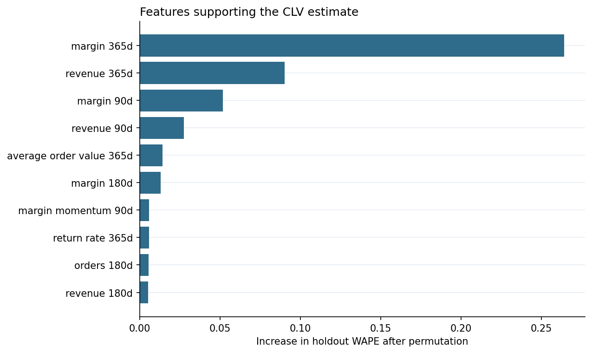

# Model Card

## Model summary

| Item | Detail |
|---|---|
| Model | Two-part histogram gradient boosting with separate quantile models |
| Unit of prediction | Synthetic customer at a scoring snapshot |
| Target | Discounted contribution margin over the next 180 days |
| Data | Fully synthetic non-contractual ecommerce behavior |
| Validation | Blocked model selection, dedicated interval calibration, and one untouched test snapshot |
| Primary metric | WAPE |
| Decision use | Relative prioritization and configurable service tiers |

## Intended use

- Compare customers on expected near-term contribution margin.
- Allocate limited review or service capacity by transparent relative tiers.
- Set conservative policy guardrails using a lower prediction bound.
- Demonstrate a reproducible CLV workflow before adapting it to approved business data.

## Out-of-scope use

- Claiming production accuracy from the synthetic metrics.
- Inferring the causal effect of a retention or marketing treatment.
- Making credit, employment, insurance, healthcare, or other high-stakes eligibility decisions.
- Using the score as the sole basis for excluding customers from essential support.
- Interpreting 180-day value as an unlimited lifetime estimate.

## Untouched holdout performance

| Metric | Model | Baseline |
|---|---:|---:|
| WAPE | 0.421 | 0.592 |
| MAE | 32.54 | 45.67 |
| RMSE | 46.90 | 68.94 |
| Spearman | 0.808 | 0.736 |
| Top 10% value capture | 24.2% | 22.4% |
| Top 20% value capture | 43.3% | 40.2% |

Additional model diagnostics:

- Activity average precision: 0.977.
- Activity Brier score: 0.082.
- Raw nominal 80% interval coverage: 71.4%; mean width: 98.40.
- Split-conformal 80% interval coverage: 81.4%; mean width: 104.70.
- Protect-tier and highest-decile calibrated coverage: 74.3%; marginal calibration does not guarantee equal conditional coverage.
- Calibration increased the high-uncertainty flag rate from 67.3% to 70.1% and reduced the aggregate investment ceiling from 4,220.8 to 3,905.9 synthetic currency units.

## Important drivers

The project reports permutation importance as the increase in holdout WAPE when each feature is shuffled. This is global predictive importance, not a causal explanation. Results are stored in `artifacts/feature_importance.csv` and regenerated with the pipeline.

## Risks and monitoring

- **Calibration drift:** track raw and calibrated interval coverage and activity Brier score by scoring month.
- **Conditional undercoverage:** review coverage by value decile and service tier; the committed Protect-tier result remains below target.
- **Ranking drift:** compare top-decile realized value capture with the baseline.
- **Data drift:** monitor recency, order frequency, margin, return, and acquisition-channel distributions.
- **Policy drift:** review tier capacity and investment caps separately from model retraining.
- **Selection effects:** treatment changes future observations; use experiments to measure intervention impact.

Before deployment, rebuild contribution margin definitions, exclude prohibited variables, test performance across relevant operational groups, calibrate uncertainty, document review rights, and establish a retraining threshold.

## Public validation companion

This is an external check of the analytical method, not a production validation of the
synthetic policy.

| Item | Public companion |
|---|---|
| Data | UCI Online Retail II, CC BY 4.0 |
| Unit | Customer at a temporal snapshot |
| Target | Next 180-day net revenue, floored at zero |
| Test | Untouched 2011-06-01 snapshot, 4,933 customers |
| Safe decision use | Relative ranking and fixed-capacity review evidence |
| Not supported | Profit, spend ceilings, causal treatment choice, production accuracy |

| Public holdout metric | Model | Baseline |
|---|---:|---:|
| WAPE | 0.689 | **0.662** |
| MAE | 567.32 | **545.39** |
| RMSE | 3,360.32 | **2,769.19** |
| Spearman | **0.598** | 0.557 |
| Top 10% value capture | **61.9%** | 60.6% |
| Top 20% value capture | **74.9%** | 72.6% |

The model does not beat the fixed baseline on point error. It is retained because model
selection was completed before the final test and because it provides stronger ranking
evidence; the negative result remains visible. Raw and calibrated interval coverage are
both 87.8%, with a £0 conformal correction because the calibration snapshot already
exceeded the nominal target. Highest-decile coverage is only 75.9%.

Public raw data, canonical transactions, snapshots, and customer-level scores remain
gitignored. Aggregate evidence is in
[`reports/public_validation/`](../reports/public_validation/).
